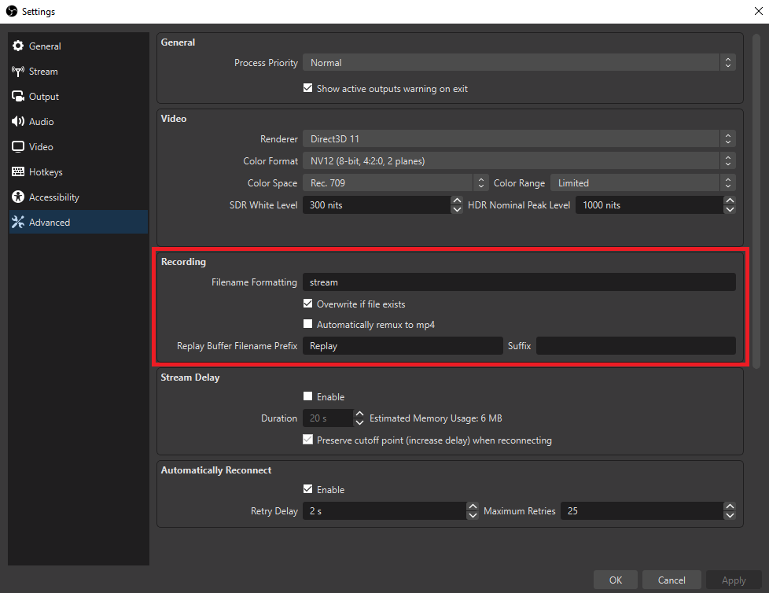
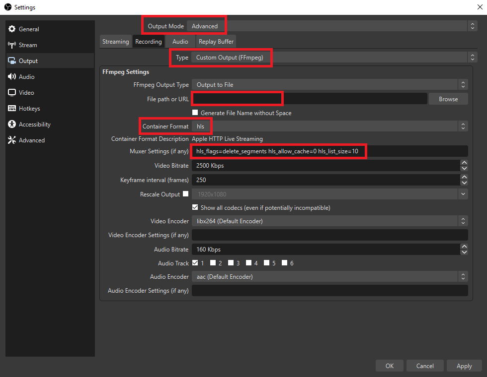

# OBS-to-local-webplayer-HLS
Stream video using OBS to a local webpage.

(Having Docker and Docker-Compose installed is needed.)


---

If you pretend to run it under a domain name with ssl:

Check the general version: [OBS-to-webplayer-HLS](https://github.com/Pablotesan/OBS-to-webplayer-HLS)

---

Steps:
1. Set up the webpage:

    - Use Docker:

      ```docker-compose up -d```

2. Configure OBS.

    - In "Settings/Advanced" in "Recording" section:

        - Set Filename Formatting to: "stream".
        - Set "Overwrite if file exists".

          


    - In "Output" section, using Advanced mode:

        - Set "Type" to "Custom Output FFMmpeg"
        - Set "File path" to the "video" folder cloned with the repository.
        - Set "Container Format" as "hsl".
        - Configure "Muxer Settings" as you like. 

          For example:

          ```hls_flags=delete_segments hls_allow_cache=0 hls_list_size=10```

          Will keep up to 10 fragments and remove older ones when new ones are genereated.


          

3. Go to "[http://localhost:80](http://localhost:80)" and enjoy.
